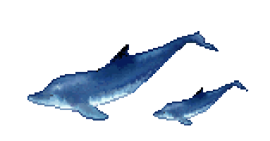
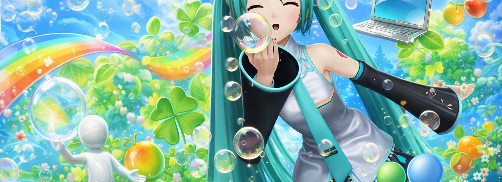
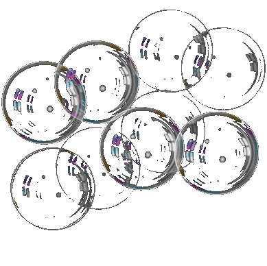

<table align="center" border="0" cellspacing="0" cellpadding="0">
<tr>
<td valign="middle">

</td>
<td valign="middle">
<b>Olá, me chamo Matheus</b>
</td>
<td valign="middle">
&nbsp;&nbsp;&nbsp;&nbsp;🎓 Estudante de Engenharia de Software 
&nbsp;&nbsp;&nbsp;&nbsp;⚙️ Interessado em Engenharia de Dados
</td>
</tr>
</table>

---

<b>Repositórios em destaque</b>

<table align="center" border="0" cellspacing="10" cellpadding="0">
<tr>
<td align="center">
<a href="https://google.com">projetos-faculdade</a>
</td>
<td align="center">
<a href="https://google.com">projetos-pessoais</a>
</td>
</tr>
</table>

---

---

<b>Onde me encontrar</b>

---
